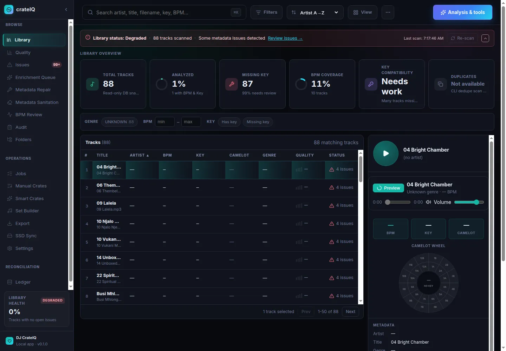
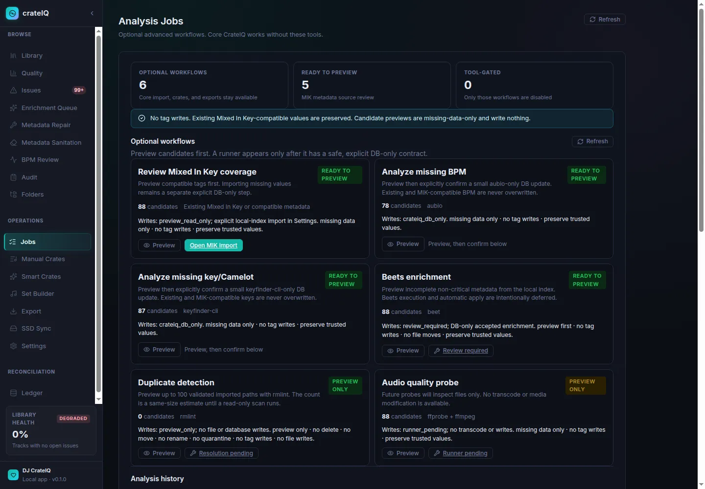
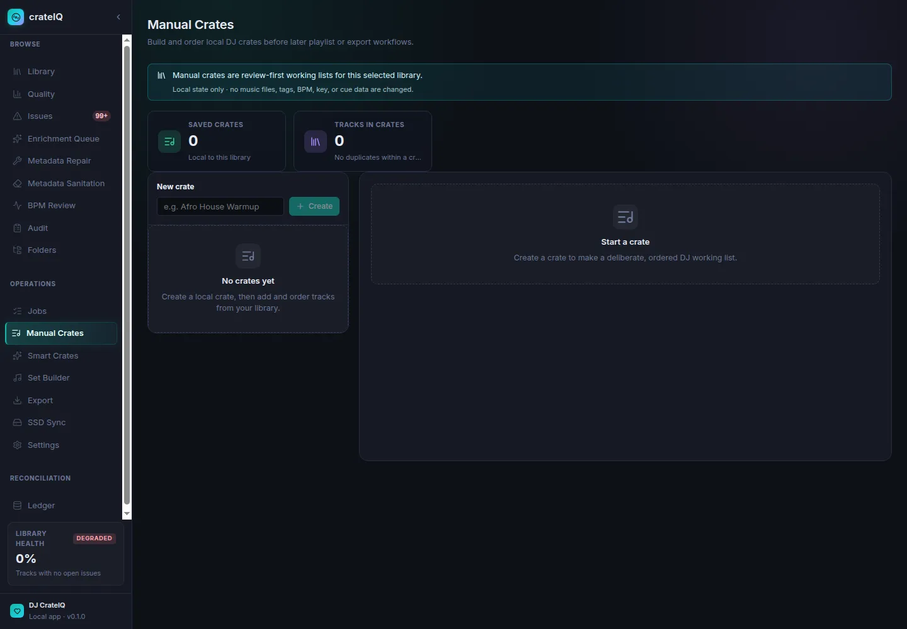
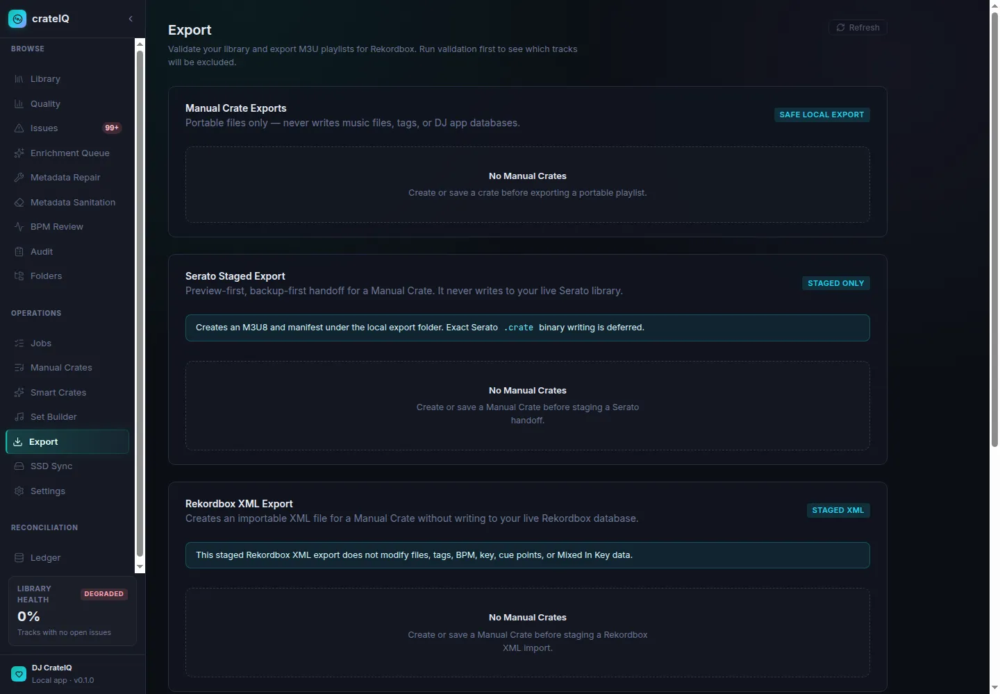

# crateIQ

**Local-first DJ music library intelligence for safer crates, metadata review, harmonic planning, and export prep.**

crateIQ is a local app for DJs who want to inspect a music library, make
deliberate crates, review existing metadata, and prepare portable exports
without handing control of their collection to a cloud service or automatic
file-writing workflow.



*The Library workspace: local index health, filtering, track review, harmonic context, and browser-native preview.*

## What crateIQ does

- Initializes and imports a local music folder into CrateIQ's own SQLite index.
- Reviews library quality, issues, folders, and existing metadata.
- Builds ordered Manual Crates and saves Smart Crate suggestions as editable
  Manual Crates.
- Uses a persistent browser-native bottom player to preview safely available
  files across Library, Music Review, and route changes.
- Creates portable CSV, JSON, M3U, and UTF-8 M3U8 crate exports.
- Stages Serato handoffs and Rekordbox-importable XML; it does not write either
  application's live database.
- Reviews and imports Mixed In Key-compatible BPM/key metadata into CrateIQ's
  local index only.
- Offers optional, explicitly requested BPM and key/Camelot analysis for tracks
  still missing trusted values.

## Local-first safety model

- **Your source music files and tags are not modified** by library setup,
  import, crate building, preview, or the portable/staged export workflows.
- **Import does not run BPM or key analysis.** Analysis is optional,
  preview-first, and only starts after explicit confirmation.
- **Mixed In Key-compatible values are trusted and preserved.** crateIQ fills
  only missing local-index values and never overwrites trusted BPM, key, or cue
  information.
- **Optional tools are scoped to their own jobs.** Their absence does not block
  import, browsing, crates, preview, or portable exports.
- **Serato and Rekordbox live databases are never written.** Exports are staged
  artifacts for review or manual import.
- **No cloud account is required.** crateIQ is intended for trusted local use;
  it currently has no authentication for remote or multi-user deployment.

## Feature status

| Feature | Status | Notes |
| --- | --- | --- |
| Library setup and import | Implemented | Explicit initialize → scan preview → import flow; writes CrateIQ's local index only. |
| Manual Crates | Implemented | Create, edit, reorder, and save local DJ working lists. |
| Smart Crates | Implemented | Deterministic suggestions from existing local metadata; save as Manual Crates. |
| Persistent audio preview | Implemented | App-shell bottom player with Library/Music Review queues, route persistence, seek, volume, and safe unavailable states. |
| Portable exports | Implemented | CSV, JSON, M3U, and M3U8, with safe staged output paths. |
| Staged Serato export | Implemented | M3U8 plus manifest handoff; exact binary `.crate` writing is deferred. |
| Staged Rekordbox XML export | Implemented | Importable XML file only; no live Rekordbox database writer. |
| MIK coverage/import | Implemented foundation | Explicit read-only metadata preview and DB-only import; cue-tag parsing is deferred. |
| BPM analysis with `aubio` | Implemented safe runner | Preview and confirmation required; only missing BPM is eligible. |
| Key/Camelot with `keyfinder-cli` | Implemented safe runner | Preview and confirmation required; only missing key/Camelot is eligible. |
| Beets enrichment | Selected-field DB-only review | Local missing-field candidates; explicit saved/confirmed artist/title/genre apply, no `beet` invocation or tag/file writes. |
| Metadata Sources | Settings foundation | Local tags, MIK, Beets, and future APIs are modeled; external APIs are disabled by default and do not yet perform lookup. |
| Multi-source enrichment review | Implemented foundation | Compares conservative local suggestions and source status; selected empty local-index fields only. No provider API calls. |
| Genre Taxonomy | Implemented foundation | Review-first Ghana/Africa and DJ-friendly genre normalization in the local index; raw values stay preserved. |
| Duplicate detection with `rmlint` | Preview + DB-only review | Bounded JSON scan plus local keep/ignore/review-later notes; no delete, move, rename, or quarantine action. |
| Audio quality probe with `ffprobe` | Probe + DB-only review | Bounded JSON checks plus local review notes; no transcode, remediation, file, or tag writes. |
| Real waveforms | W1–W6 implemented | Explicit, demand-driven backend generation (`POST` to request, side-effect-free `GET` to read, bounded single-worker scheduler, deduplication, cancellation, atomic gzip-JSON cache, ETag) plus a canvas waveform in the persistent player with click/drag/touch/keyboard seeking, a played/unplayed progress overlay, a decorative fallback for every non-ready state, and full native accessible slider semantics. The cache is bounded and self-maintaining, with a confirmation-gated manual clear. |
| Live Serato/Rekordbox DB writes | Not supported by design | crateIQ stages artifacts only. |

### Browser playback notes

The persistent player streams only through the existing DB-backed
`/api/tracks/{track_id}/preview-audio` endpoint. Playback availability depends
on the selected file existing under the configured library root and on the
browser supporting its audio format. Missing, out-of-root, or unsupported
files show an unavailable state; crateIQ does not transcode them.

Library queues the currently visible filtered page. Music Review queues its
current review list, keeps next/previous selection synchronized with the bottom
player, and does not save a review merely because a track was selected or
played. The low/mid/high display is a deterministic visual placeholder—not an
extracted waveform or audio analysis. Player use never writes tags, audio
files, BPM, key, Camelot, cues, MIK data, crate order, or DJ databases.

The 2026-08-05 playback pass verified MP3 and FLAC in Chrome using the explicit
`crateiq-test-library`; this is evidence for those files in that browser, not a
claim that every codec/container works everywhere. Queue boundaries do not
wrap. A natural track end advances and continues when another queue item exists,
while the final item stops safely. The player labels the source as Library or
Music Review and does not display the indexed absolute local filepath.

## Screenshots

### Library


### Analysis Jobs



### Manual Crates



### Exports



The live Settings screenshot is deliberately not published because it displays
the active local library location. The existing
[`settings.webp`](docs/mockups/settings.webp) remains a visual mockup/reference,
not a product screenshot.

## Quick start

Requirements:

- Python 3.10 or newer
- Node.js and npm
- SQLite (normally provided by Python)

```bash
cd ~/code/gewcc/crateIQ

python3 -m venv .venv
.venv/bin/pip install -r requirements-dev.txt
npm --prefix frontend install

# Starts only crateIQ on backend :8020 and frontend :5175.
scripts/crateiq-local-services.sh start
```

The `start` command asks you to choose a library profile and access mode. For
the safest first run, choose **Demo library** and **Local only**. Then open
<http://127.0.0.1:5175>.

For a non-interactive demo launch:

```bash
.venv/bin/python scripts/seed_demo_library.py --reset
scripts/crateiq-local-services.sh start-demo-local
```

For a configured library, first open **Settings** to choose a folder,
initialize CrateIQ's local `logs/processed.db`, scan it explicitly, and import
the previewed audio paths. Restart with the configured profile after saving the
root:

```bash
scripts/crateiq-local-services.sh start-library-local
```

The configured root is stored locally in ignored `.run/local/crateiq.env`.
Initialization creates CrateIQ's `logs/` and `exports/` folders only; it does
not scan or alter music files. Scanning is always an explicit later action.

### Service commands

```bash
scripts/crateiq-local-services.sh status --short
scripts/crateiq-local-services.sh stop
scripts/crateiq-local-services.sh start
scripts/crateiq-local-services.sh logs
```

The helper manages only crateIQ's ports (`8020` and `5175`). It does not stop
or alter LedgerIQ or opsIQ.

## Optional analysis tools

Core crateIQ workflows do not require external analysis tools. Settings and
Analysis Jobs show each capability independently:

| Optional tool/input | Current workflow |
| --- | --- |
| Mixed In Key-compatible metadata | Explicit coverage preview and local-index-only import. |
| `aubio` | Preview-first, confirmed missing-BPM analysis. |
| `keyfinder-cli` | Preview-first, confirmed missing key/Camelot analysis. |
| `beet` | Preview-limited enrichment planning only. |
| `rmlint` | Preview-only duplicate candidates only. |
| `ffprobe` | Bounded preview-only audio metadata checks; no transcode or writes. |
| `ffmpeg` | Reserved for separate, explicitly scoped decode/conversion workflows. |

See [local tooling guidance](docs/operations/LOCAL_TOOLING.md) for setup notes
and exact safety boundaries.

### Waveform W1 configuration

Waveform Phase W1 adds only an optional backend foundation. The default cache
root is `backend/data/cache/waveforms/`, inside the already ignored backend
runtime-data tree. An override must be absolute and is rejected if it equals,
contains, or sits below the selected music-library root, including after
symlink resolution.

| Environment variable | Default |
| --- | --- |
| `CRATEIQ_WAVEFORMS_ENABLED` | `1` |
| `CRATEIQ_WAVEFORM_CACHE_DIR` | backend-owned cache root |
| `CRATEIQ_WAVEFORM_MAX_CONCURRENCY` | `1` (valid 1–2) |
| `CRATEIQ_WAVEFORM_MAX_QUEUE_SIZE` | `32` |
| `CRATEIQ_WAVEFORM_MAX_CACHE_BYTES` | `2147483648` (2 GiB) |

Runtime readiness reports `disabled`, `misconfigured`, `cache_unavailable`,
`extractor_unavailable`, or `detected`. In W1, `detected` means FFmpeg and
ffprobe were found passively; neither executable was run and versions remain
unverified. `ready` is reserved for a future verified extractor contract.
Waveform operational state is stored only in backend `jobs.db`; the trusted
library `processed.db` is not extended or written by this foundation.

Phase W2 adds the internal extraction engine
(`backend/app/services/waveform_extractor.py` and supporting
`waveform_probe.py`/`waveform_peaks.py`/`waveform_process.py` modules): a
bounded, read-only ffprobe policy check, a fixed argument-vector FFmpeg decode
command with no shell and no output file, and a bounded streaming min/max peak
accumulator with extrema-preserving downsampling.

### Waveform generation API (W3)

Phase W3 connects that engine to an explicit, demand-driven lifecycle.

| Endpoint | Behavior |
| --- | --- |
| `GET /api/tracks/{id}/waveform?resolution=compact\|player\|detail` | Read-only state; returns peaks only when `ready`. Sends an `ETag` and honors `If-None-Match` with `304`. |
| `POST /api/tracks/{id}/waveform/generate` | The only way to create work. Body `{"force": false}`. Returns `202` queued, `200` when already ready, `429` when the queue is full, `503` when unavailable. |
| `GET /api/waveform-jobs/{job_id}` | Privacy-safe job status. |
| `DELETE /api/waveform-jobs/{job_id}` | Best-effort cancellation; idempotent, and never deletes an already-published waveform. |

Waveforms are **never** generated automatically — not by starting CrateIQ,
selecting or scanning a library, opening Library or Music Review, selecting a
track, starting playback, or calling the waveform `GET`. Generation is always
an explicit request.

Artifacts are disposable gzip JSON under the app-owned cache root, named only
by a `generation_key`: the SHA-256 of a small structure of `stat` identity plus
schema/algorithm versions. **No music file is ever hashed** — full-content
SHA-256 remains deferred. Deleting the entire waveform cache has no effect on
playback, tags, metadata, crates, reviews, exports, or DJ software.

Generation runs on one bounded worker (maximum two) with a 32-job queue,
deduplicates concurrent requests for the same source generation, and supports
cancellation. A backend restart closes out interrupted jobs and never resumes
analysis on its own. Reading a cached waveform keeps working even if FFmpeg
later disappears; only new generation requires the toolchain.

### Waveform in the player (W4)

The persistent bottom player draws the real waveform on a `<canvas>` when one
is available, with a played/unplayed progress overlay driven by the existing
player clock. Every other state — checking, not generated, queued, generating,
failed, unsupported, out of date, cancelled — keeps the decorative three-band
placeholder and adds a short status line.

Generation is always an explicit click on **Generate waveform**. Opening the
app, changing route, selecting a track, starting playback, or reading waveform
state never generates anything. While a job runs, the player offers **Cancel**,
which cancels waveform generation only and never affects audio playback.

The waveform itself is now the seek control: click, drag, touch, and keyboard
(Arrow Left/Right, Home, End, Page Up/Down) all work directly on the
waveform box, whether or not a real waveform has been generated — seeking is
an audio-player capability, not a waveform-generation capability. A thin
cyan playhead needle marks the exact position over both the real waveform and
the decorative fallback. The control has a clear accessible name ("Seek audio
preview position"), an announced `m:ss of m:ss` position, and a visible focus
ring; there is exactly one accessible seek slider per player, not two. A
waveform failure never disables play, pause, next, previous, or the queue,
and seeking never issues a waveform-generation request.

### Waveform cache lifecycle (W6)

The waveform cache is derived, disposable, CrateIQ-owned data. It is bounded
and maintains itself; it is never allowed to grow without limit and never
requires manual attention to stay correct.

| Endpoint | Behavior |
| --- | --- |
| `GET /api/waveform-cache` | Read-only footprint: bytes used, the configured limit, artifact/temp/superseded counts, and how many tracks currently hold a ready waveform. Also the preview for the clear action. |
| `POST /api/waveform-cache/clear` | Requires `{"confirm": true}`. Without it the request returns `400 WAVEFORM_CACHE_CLEAR_NOT_CONFIRMED` and deletes nothing. |

Automatic maintenance runs at startup and after each publication:

- abandoned `.tmp.*` files older than 24 hours are swept;
- artifacts under a superseded schema/algorithm layout are removed after 7
  days, since a version mismatch can never be served;
- above the configured limit (2 GiB by default) the cache prunes to 80% of it,
  removing orphans and non-ready artifacts before touching least-recently-used
  ready ones, and never evicting the artifact that was just published;
- tracks claiming a waveform whose file has disappeared are repaired to
  `stale` rather than left advertising a missing file;
- failed/cancelled job rows and quiet, artifact-less track states expire after
  30 days. Rows only — no artifact and nothing in `processed.db`.

Clearing the cache, by hand or by eviction, **cannot** affect source audio,
tags, BPM/key/cue values, playlists, crates, review state, exports, or any DJ
database. Affected tracks simply return to a non-ready state until a waveform
is explicitly regenerated; nothing is re-queued automatically. Deletion is
confined to CrateIQ's own artifact/temp filenames inside the validated cache
root, symlinks are never followed out of it, and unknown files are left alone.

A backend restart closes out interrupted jobs, repairs cache state, and
verifies the extractor toolchain once with `ffmpeg -version` / `ffprobe
-version` — no media path is passed to either binary. Readiness reports
`ready` only after that check passes; `GET /api/runtime/readiness` itself
never spawns anything.

## Development

```bash
# Focused backend coverage for the current safe analysis workflows
.venv/bin/python -m pytest -q tests/test_backend_api.py -k "analysis or jobs"
.venv/bin/python -m pytest -q tests/test_waveform_foundation.py tests/test_preflight.py
.venv/bin/python -m pytest -q tests/test_waveform_peaks.py tests/test_waveform_process.py tests/test_waveform_probe.py tests/test_waveform_extractor.py
.venv/bin/python -m pytest -q tests/test_waveform_artifact.py tests/test_waveform_scheduler.py tests/test_waveform_api.py
.venv/bin/python -m pytest -q tests/test_waveform_operations.py tests/test_waveform_cache_cleanup.py
.venv/bin/python -m pytest -q tests/test_supported_route_contracts.py

# Frontend checks
npm --prefix frontend run typecheck
npm --prefix frontend run build

# Repository hygiene
git diff --check
git status --short
```

Useful local endpoints:

- Frontend: <http://127.0.0.1:5175>
- Backend health: <http://127.0.0.1:8020/api/health>
- Runtime readiness: <http://127.0.0.1:8020/api/runtime/readiness>

## Project map

- `backend/app/` — FastAPI API, safe local services, schemas, and route logic.
- `frontend/` — React/Vite interface.
- `scripts/` — local service helper and demo-library seeding.
- `docs/operations/LOCAL_TOOLING.md` — optional-tool setup and workflow scope.
- `docs/audits/CRATEIQ_FUNCTIONALITY_WORKFLOW_AUDIT.md` — current product,
  workflow, and dependency audit.

## Contributing

Keep changes local-first and reviewable. Do not introduce automatic file/tag
writes, overwrite Mixed In Key values, or write live Serato/Rekordbox
databases. Run focused checks for the surface you change, avoid committing local
databases and `.run/` data, and document any behavior change.
